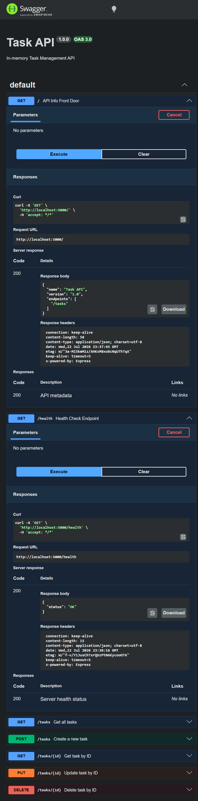

# Task API

A simple in-memory Task Management API built with Express and documented with Swagger UI.

## What this is

This project is a Node.js/Express API that supports basic task management operations: list tasks, get a task by ID, create tasks, update tasks, and delete tasks. The data is stored in-memory, so it resets when the server restarts.

## Install & Run

Install dependencies and start the server with:

```bash
npm install && npm start
```

The API listens on `http://localhost:5000` and Swagger documentation is available at `http://localhost:5000/api-docs`.

## Endpoints

| Method | Path | Description | Request Body | Response Codes |
|--------|------|-------------|--------------|----------------|
| GET | `/` | API info front door | none | `200` |
| GET | `/health` | Health check endpoint | none | `200` |
| GET | `/tasks` | Get all tasks | none | `200` |
| POST | `/tasks` | Create a new task | `{ "title": "string" }` | `201`, `400` |
| GET | `/tasks/{id}` | Get a task by ID | none | `200`, `404` |
| PUT | `/tasks/{id}` | Update a task by ID | `{ "title": "string", "done": true }` | `200`, `400`, `404` |
| DELETE | `/tasks/{id}` | Delete a task by ID | none | `200`, `404` |

## Sample curl output

This sample was captured from:

```bash
curl -i http://localhost:5000/tasks
```

```text
HTTP/1.1 200 OK
X-Powered-By: Express
Content-Type: application/json; charset=utf-8
Content-Length: 149
ETag: W/"95-1fDtRgv1+RbhJvvPEM73txK/t9Q"
Date: Wed, 22 Jul 2026 23:37:23 GMT
Connection: keep-alive
Keep-Alive: timeout=5

[{"id":1,"title":"Intern with FlyRank AI","done":true},{"id":3,"title":"Get a job","done":false},{"id":4,"title":"Is this API working","done":false}]
```

## Swagger Screenshot


